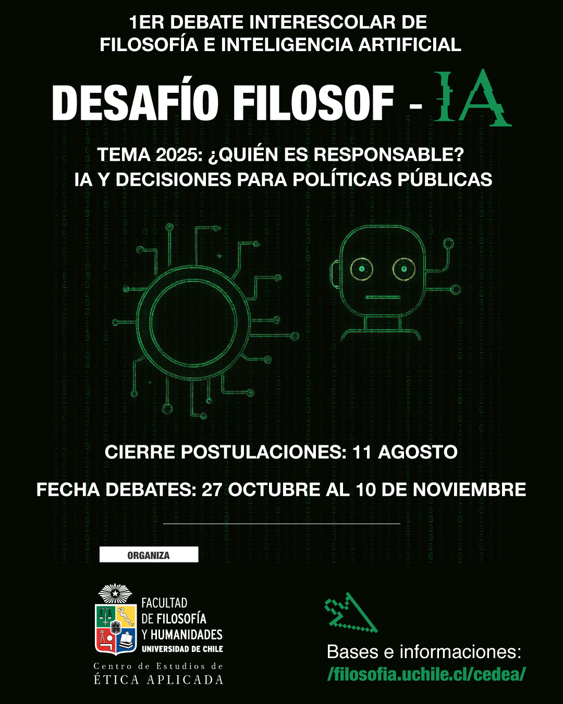

# 🏆 Convocatoria — Desafío Filosof-IA 2025

La Universidad de Chile, a través del Centro de Estudios de Ética Aplicada, se enorgullece en anunciar el **I Torneo Interescolar de Debate Filosófico e Inteligencia Artificial**. Este evento busca fomentar el pensamiento crítico y la reflexión ética entre estudiantes de 3° y 4° medio, abordando los desafíos contemporáneos que plantea la inteligencia artificial en la sociedad.

## 📅 Tema 2025

### ¿Quién es responsable? IA y decisiones para políticas públicas

En un mundo cada vez más mediado por sistemas de inteligencia artificial, surge una pregunta fundamental: ¿quién asume la responsabilidad por las decisiones tomadas con el apoyo o la intervención de estas tecnologías? Este tema invita a explorar las implicancias filosóficas y éticas de delegar decisiones públicas a algoritmos y sistemas inteligentes, considerando la transparencia, la rendición de cuentas y el impacto en la justicia social y el bienestar colectivo.

## 📋 Bases y estructura del torneo

El torneo se desarrolla en una **adaptación de WSDC/MED** y sigue el siguiente **flujo de discursos (5 minutos cada uno)**:  
1. Primera persona de proposición (5 min)  
2. Primera persona de oposición (5 min)  
3. Segunda persona de proposición (5 min)  
4. Segunda persona de oposición (5 min)  
5. Tercera persona de proposición (5 min)  
6. Tercera persona de oposición (5 min)  
7. Réplica de oposición (5 min)  
8. Réplica de proposición (5 min)

**Tiempo de libre disposición: 3 min por equipo.**  
Se puede usar antes o después de cualquier discurso, en fracciones (p. ej., 30 s, 45 s, 1 min). **No está permitido usar IA ni material de estudio en este lapso.** Si un equipo pide tiempo, **ambos** pueden usarlo.

**Tipos de discursos**  
- **Constructivos:** los seis primeros. **Aceptan PdI entre el minuto 1 y 4**; cada PdI dura **≤ 15 s**; se sugiere aceptar y ofrecer al menos uno.  
- **Réplica:** los dos últimos (sin PdI).

**Puntos de Información (PdI)**  
Solicitud según lo indicado por la persona oradora; si no se indica, levantarse y decir “punto de información”, “sobre eso” o “punto” (sin revelar contenido hasta que se otorgue la palabra). Si se rechaza, sentarse/silenciarse de inmediato. La formulación y respuesta a PdI incide en la evaluación. 

**Rol de la persona jueza y control de tiempo**  
La jueza dirige el debate, hace cumplir el reglamento y llama a cada orador/a. Señales a **1’, 4’ y 5’** (campanada, palmada, golpe, etc.). 

**Tipos de rondas y tiempos de preparación**  
- **Impromptu:** **60 min** de preparación desde la lectura de la moción.  
- **Preparadas:** **10 min** de preparación tras anunciar posturas.  

**Uso de IA**  
- **Permitido y reconocido en rondas Impromptu** (versiones de libre acceso).  
- Al finalizar, el equipo **puede presentar** sus conversaciones con IA, mostrando cómo interrogaron y reflexionaron (descarga desde dispositivos de la universidad o envío desde dispositivos personales)

**Evaluación**  
Se valoran especialmente las **capacidades investigativas, reflexivas, interpretativas y argumentativas** en compromiso con la filosofía. Se considera la **recepción de un dossier** con investigaciones y preparaciones argumentativas para tesis **Preparadas**, evaluado por un jurado especializado.

**Clasificación a rondas eliminatorias**  
El avance no depende únicamente de ganar o perder; se progresa según **puntaje total** obtenido, según la estructura general del campeonato (convocatoria, fase de debates y evaluación/retroalimentación).

## 👥 Público objetivo y formato general

Participan **equipos de 3° y 4° medio** acompañados/as por sus docentes de filosofía. La organización contempla formativas, jornada de debates (clasificatoria, semifinal y final) y evaluación/retroalimentación.

## 📑 Documentos oficiales

- [Bases DESAFÍO Filosofía 2025 (PDF)](Bases_Desafio_FilosofIA_2025.pdf)  
- [Estructura y formato (PDF)](Estructura_y_formato_2025.pdf)  
- [Tema 2025 (PDF)](Tema_2025.pdf)

## 🖼️ Imagen oficial

