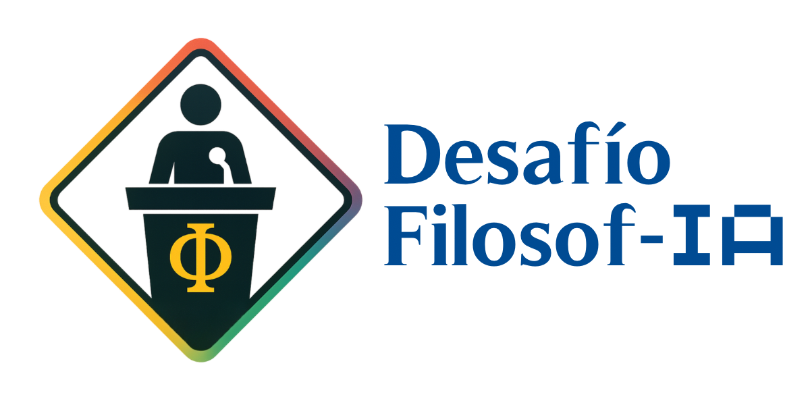

  

# 🏛️ FilosofIA — IA en Educación, Debates y Filosofía

Te damos la bienvenida a **Filosof-IA**, un proyecto colaborativo para docentes y estudiantes que desean integrar la inteligencia artificial de forma crítica, ética y pedagógica en el aula.

Esta wiki ofrece recursos prácticos, plantillas de trabajo, fundamentos teóricos y estrategias para el uso responsable de **IA generativa en contextos educativos**, con especial énfasis en el debate filosófico.

---

## 🧭 ¿Por dónde empezar?

- 🏆 [Desafío Filosof-IA - Torneo Interescolar de Debates 2025](Debates/index.md)
- 📘 [Guía de Inicio](Guia-de-Inicio.md)
- 🔍 [Mapa Completo de Contenidos](Mapa-Completo-de-Contenidos.md)
- 🤖 [Conceptos Básicos de IA](Fundamentos/Conceptos-basicos-IA.md)
- 📚 [Lecturas Recomendadas](Biblioteca/Lecturas-Recomendadas.md)
- 🛠️ [Manual de Buenas Prácticas](Herramientas/Manual-de-Buenas-Practicas.md)
- 🧩 [Plantillas de Prompts](Herramientas/Plantillas-de-Prompts.md)
- ⚖️ [Principios Éticos y Regulaciones](Etica/Principios-Eticos-y-Regulaciones.md)
- 🧮 [Evaluación de Impacto en Entornos Educativos](Etica/Evaluacion-de-Impacto.md)
- 🎯 [Capacidades Clave en Educación y IA Generativa](Etica/Capacidades-Clave-Educacion-IA.md)

---

## 📢 Contenidos destacados

- 📝 [Noticias y Actualizaciones](Comunidad/Noticias-Actualizaciones.md)
- 🎓 [Eventos y Talleres](Comunidad/Eventos-Talleres.md)
- 🗣️ [Debates 2025](Debates/index.md)

---

## 📢 Convocatoria 2025

El Centro de Estudios de Etica Aplicada ([CEDEA](https://filosofia.uchile.cl/cedea/)) de la Facultad de Filosofía y Humanidades de la Universidad de Chile (UCH), en colaboración con el Departamento de Filosofía, organizan DESAFÍO FILOSOF-IA, un Campeonato interescolar de Debates Filosóficos anuales en formato presencial que invita a estudiantes secundarios de 3ero y 4to medio, en conjunto con sus profesores de filosofía, debatir filosóficamente sobre diversos dilemas éticos, existenciales y políticos relacionados con la Inteligencia Artificial (IA) y utilizando precisamente herramientas IA, como ChatGPT u otras herramientas afines, de software abierto. Los debates se realizarán del **27 de octubre al 10 de noviembre de 2025**

Invitamos a estudiantes, educadores y entusiastas a participar en los eventos de debate de este año. Para información detallada sobre cómo unirse, fechas importantes y pautas, por favor consulte la página de [Convocatoria 2025](./Debates/2025/Convocatoria-2025.md).

## 📑 Documentos oficiales

Los documentos oficiales del torneo están disponibles en el repositorio:

- [Bases Desafío Filosofía 2025 (PDF)](./Debates/2025/Bases_Desafio_FilosofIA_2025.pdf)  
- [Estructura y formato (PDF)](./Debates/2025/Estructura_y_formato_2025.pdf)  
- [Tema 2025 (PDF)](./Debates/2025/Tema_2025.pdf)

Más informaciones en: [CEDEA](https://filosofia.uchile.cl/cedea/) y en desafiofilosofia@uchile.cl

---

## 🖼️ Afiche

---

## 📰 Difusión

- 📝 ["DESAFÍO FILOSOF-IA ¿Quién es responsable? IA y decisiones para políticas públicas"](https://filosofia.uchile.cl/noticias/230430/desafio-filosof-ia)

## 🗺️ Estructura

Explora las principales secciones:

- **Debates 2025**: Desafío Filosof-IA 2025 ([Debates/index.md](Debates/index.md)) 
- **Fundamentos**: Introducción a la IA, su historia, adaptaciones al aula. ([Fundamentos/index.md](Fundamentos/index.md))
- **Herramientas**: Prompts, buenas prácticas, plantillas. ([Herramientas/index.md](Herramientas/index.md))
- **Ética y regulación**: Principios, sesgos, políticas. ([Etica/index.md](Etica/index.md))
- **Comunidad**: Cómo contribuir, ideas compartidas. ([Comunidad/index.md](Comunidad/index.md))

---

## 🌍 Licencia y contribución

Este proyecto se publica bajo [CC BY-SA 4.0](https://creativecommons.org/licenses/by-sa/4.0/).  
Puedes sugerir cambios, abrir *issues* o enviar *pull requests* a través de [nuestro repositorio](https://github.com/a-lfre-do/Filosof-IA).
